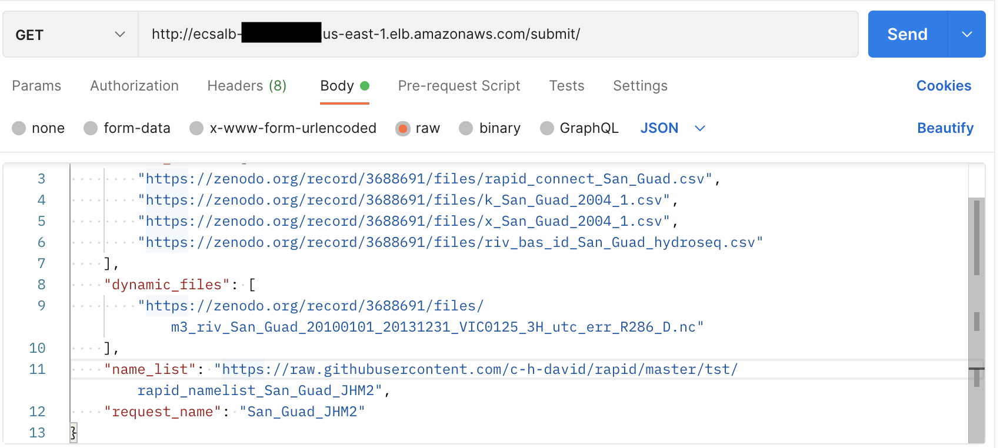

# CURRNT
Combined Utilities for River Routing, Nested Together

## Local webserver:
cd app
docker build -t rapid_d . 
docker container create -i -t -v ~/.aws:/root/.aws -p 5000:5000 --name rapid_c rapid_d
docker container start --attach -i rapid_c

## Terraform deployment on AWS:

based on https://aws.amazon.com/blogs/opensource/deploying-python-flask-microservices-to-aws-using-open-source-tools/

——

Create bucket on aws with 7 day expiration

—-

aws ecr create-repository \
    --repository-name rapid_depl_demo \
    --image-scanning-configuration scanOnPush=true \
    --region us-east-1

output: {
    "repository": {
        "repositoryArn": "arn:aws:ecr:us-east-1:###:repository/rapid_depl_demo",
        "registryId": "###", <— AWS_ID
        "repositoryName": "rapid_depl_demo",
        "repositoryUri": "###.dkr.ecr.us-east-1.amazonaws.com/rapid_depl_demo",
        "createdAt": "2022-07-13T20:04:51-07:00",
        "imageTagMutability": "MUTABLE",
        "imageScanningConfiguration": {
            "scanOnPush": true
        },
        "encryptionConfiguration": {
            "encryptionType": "AES256"
        }
    }
}

—-
aws ecr get-login-password --region us-east-1 | docker login --username AWS --password-stdin <AWS_ID>.dkr.ecr.us-east-1.amazonaws.com/rapid_depl_demo

Output:
Login Succeeded

—-

cd app

——

docker build --tag rapid_depl_demo .

——

docker tag rapid_depl_demo:latest <AWS_ID>.dkr.ecr.us-east-1.amazonaws.com/rapid_depl_demo:latest

—— 

docker push <AWS_ID>.dkr.ecr.us-east-1.amazonaws.com/rapid_depl_demo:latest

Output:
The push refers to repository [###.dkr.ecr.us-east-1.amazonaws.com/rapid_depl_demo] <— URL
eded89931ef1: Pushed 
e544e72303ea: Pushed 
880ad8906583: Pushed 
4b37b6de3b36: Pushed 
3ec7fcb879cc: Pushing  4.476GB/6.247GB
13dacb3099da: Pushed 
8b16748fbb7a: Pushed 
e6aa51a9b818: Pushed 
10e6bc6fdee2: Pushed 

——-

cd ../terraform

——

Terraform init

——-

terraform fmt -recursive

——

terraform validate

——

terraform plan

Enter a value: URL from docker push step 

(ex: 
###.dkr.ecr.us-east-1.amazonaws.com/rapid_depl_demo
)

——-

Terraform apply

Enter a value: Url from docker push step 

(ex: 
###.dkr.ecr.us-east-1.amazonaws.com/rapid_depl_demo
)

Enter a value: 

yes

Output:
…
alb_dns_name = "ecsalb-###.us-east-1.elb.amazonaws.com"

——

Destroy deployment:

terraform destroy

###.dkr.ecr.us-east-1.amazonaws.com/rapid_depl_demo

yes

—— 

## API request:

Download Postman

Create new API request

Change request type to GET

For AWS deployment:
In link field, paste output from terraform apply, followed by /submit/ (eg ecsalb-###.us-east-1.elb.amazonaws.com/submit/)

For local deployment: 
In link field, enter http://localhost:5000/submit/

In body, specify RAW and JSON from dropdown

Run generate_request.py to create example request body

Paste output from generate_request.py into request body

Submit request